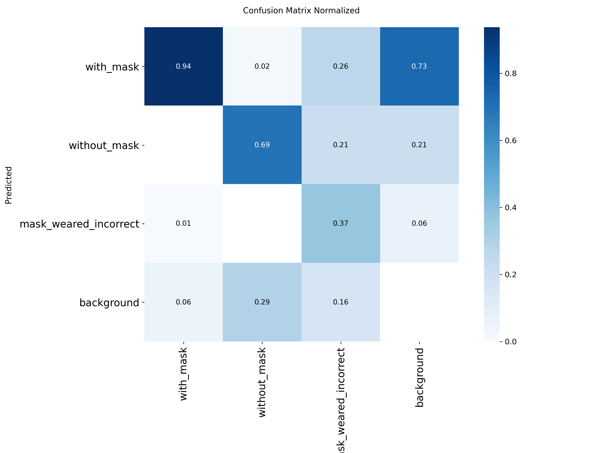
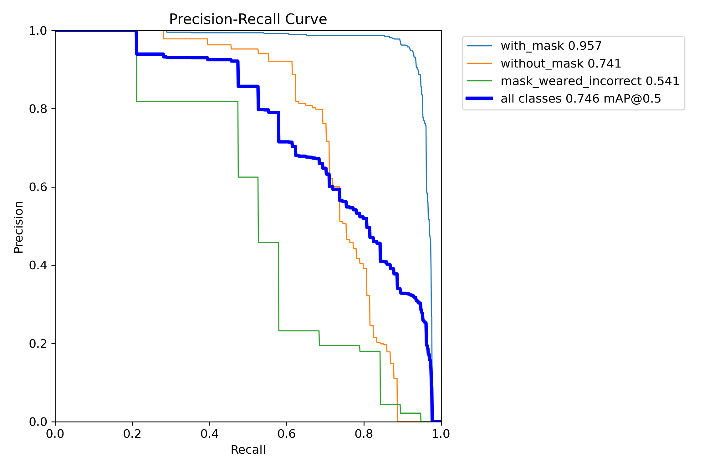
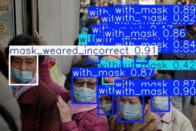

# YOLOv8 Face Mask Detection

*[Türkçe README](README.md)*

An end-to-end object detection project: a YOLOv8n model that detects
whether a face is wearing a mask correctly, incorrectly, or not at all.
Covers the full pipeline, from converting a Pascal VOC-labeled dataset to
YOLO format through interpreting the training results.

## Dataset

[Kaggle: andrewmvd/face-mask-detection](https://www.kaggle.com/datasets/andrewmvd/face-mask-detection)
— 853 images, Pascal VOC XML annotations, 3 classes:

| Class                   | Instances | Share  |
|-------------------------|----------:|-------:|
| `with_mask`             |      3232 |  77.6% |
| `without_mask`          |       717 |  17.2% |
| `mask_weared_incorrect` |       123 |   2.9% |

The class distribution is heavily imbalanced — this shows up directly in
the results below.

## Pipeline

1. **`scripts/convert_and_split.py`** — converts Pascal VOC XML annotations
   (absolute corner coordinates: xmin/ymin/xmax/ymax) to YOLO format
   (normalized center + width/height), and performs the train/val split in
   the same step (80/20, `seed=42`, 683/170 images).
2. **`dataset/data.yaml`** — YOLO training config (class names, split paths).
3. **Training** — `yolov8n`, 30 epochs, `imgsz=416`, on CPU (~36 min).
4. **Evaluation** — precision/recall/mAP, confusion matrix, PR/F1 curves
   (`runs/detect/runs/mask_detect/`).
5. **Inference test** — predictions on sample images with the trained model
   (`runs/detect/runs/inference_test/`).

## Results

Overall (all classes, `runs/detect/runs/mask_detect/results.csv`, epoch 30):

| Precision | Recall | mAP50 | mAP50-95 |
|----------:|-------:|------:|---------:|
|      0.87 |   0.67 |  0.75 |     0.52 |

Per class:

| Class                   | Precision | Recall | mAP50 | mAP50-95 |
|-------------------------|----------:|-------:|------:|---------:|
| `with_mask`             |     0.958 |  0.914 | 0.957 |    0.668 |
| `without_mask`          |     0.921 |  0.613 | 0.741 |    0.482 |
| `mask_weared_incorrect` |     0.754 |  0.474 | 0.541 |    0.409 |

**These numbers are not cherry-picked** — the model is strong on
`with_mask` (mAP50 0.96, the class with the most data) and weak on
`mask_weared_incorrect` (mAP50 0.54, the class with the least data).
Overall recall (0.67) trailing precision (0.87) traces back to the model
missing objects (low recall) in the minority classes — especially in
crowded scenes or partially visible faces. This is a direct consequence of
the dataset's class imbalance (77.6% / 17.2% / 2.9%).

**Note:** the 0.541 mAP50 for `mask_weared_incorrect` is computed over just
**19 instances** in a 170-image validation set — a statistically noisy
number where a handful of correct/incorrect predictions can shift the
score by several points. Treat this specific number as directional, not a
precise estimate, until validated on a larger test set or with
cross-validation.

### Confusion Matrix and PR Curve




### Inference Example



## Next Steps

- Data augmentation or class-weighted loss to address class imbalance
- Compare against a larger model (`yolov8s`/`yolov8m`) or more epochs
- Live inference test with a custom image or webcam

## Setup / Reproducing

Model weights (`*.pt`) and raw/processed image data (`dataset/raw/`,
`dataset/images/`) are excluded via `.gitignore` to keep the repo small.
To reproduce:

```bash
# 1. Download the dataset and extract to dataset/raw/extracted/{images,annotations}
# 2. XML -> YOLO conversion + split
python scripts/convert_and_split.py

# 3. Train
yolo detect train model=yolov8n.pt data=dataset/data.yaml epochs=30 imgsz=416
```

## Project Structure

```
scripts/convert_and_split.py   # XML -> YOLO conversion + train/val split
dataset/data.yaml              # YOLO training config
dataset/labels/                # YOLO-format labels (train/val)
runs/detect/runs/mask_detect/  # Training outputs: metrics, curves, confusion matrix
runs/detect/runs/inference_test/  # Sample inference outputs
```
